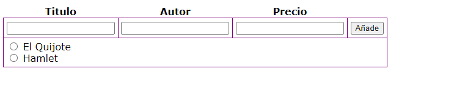
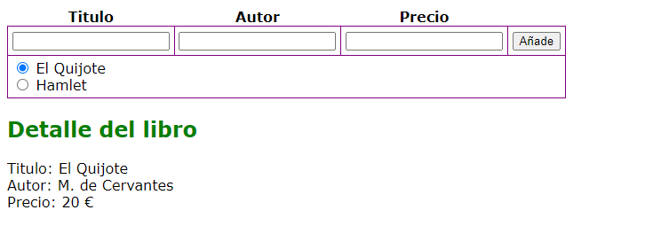

# Ejercicios JavaScript

## DOM
Dada la siguiente página HTML:

```html
<!DOCTYPE html>
<html lang="en">
<head>
  <meta charset="UTF-8">
  <title>Title</title>
</head>
<body>
<h1>Lista</h1>
<ul id="Lista">
  <li>Nombre aqui</li>
</ul>
<button disabled onclick="alert('Botón 1')">Botón 1</button>
<button onclick="alert('Botón 2')">Botón 2</button>
<button disabled onclick="alert('Botón 3')">Botón 3</button>
<button disabled onclick="alert('Botón 4')">Botón 4</button>

<script>
  
</script>
</body>
</html>
```

- Cambia el contenido del elemento h1 a "Lista de nombres"
- Crea un array de nombres de personas
- Elimina del ul#lista el único elemento que contiene
- Configura una lista en el elemento ul#lista conteniendo un ítem por cada nombre del array definido anteriormente
- Habilita todos los elementos button deshabilitados (cambia su propiedad disabled a false)

## Array de objetos
Con las siguientes estructuras de datos, hacer un listado de los nombres de los alumnos por orden descendente de nota final.

```js
// Alumnos de la asignatura
var alumnos = [
  {id: 1, nombre: 'Ana Abad'},
  {id: 2, nombre: 'Bea Bez'},
  {id: 3, nombre: 'Carlos Cruz'},
  {id: 4, nombre: 'Diego Díez'}
]

// Notas de los exámenes parciales
// No todos los alumnos se han presentado a todos los examenes 
var notasParciales = [
  {idAlum: 1, idExam: 0, nota: 5.3},
  {idAlum: 2, idExam: 0, nota: 6.8},
  {idAlum: 4, idExam: 0, nota: 5.7},
  {idAlum: 1, idExam: 1, nota: 4.1},
  {idAlum: 2, idExam: 1, nota: 5.5},
  {idAlum: 3, idExam: 1, nota: 7.39},
  {idAlum: 4, idExam: 1, nota: 8.5},
  {idAlum: 1, idExam: 2, nota: 4.2},
  {idAlum: 2, idExam: 2, nota: 7},
  {idAlum: 4, idExam: 2, nota: 5.1},
  {idAlum: 3, idExam: 2, nota: 7.3},  // Esta , "no hace daño"
]

// Pesos de los exámenes en la nota final
const pesos = [0.15, 0.25, 0.6]
```

## Repaso de eventos

(Código en carpeta "eventos")

El propósito de los manejadores es cambiar el aspecto de los inputs del formulario anterior cuando estos ganen el
foco, y recuperar el aspecto anterior, cuando pierdan el foco:

- Cuando estos ganen el foco, pondremos fondo rojo y letra blanca.
- Cuando pierdan el foco, recuperarán su aspecto inicial.


### Ejemplo 00
- ¿Qué significa this en los eventos in-line?
- ¿Cuál es realmente la función manejadora?

### Ejemplo 01
- ¿Por qué no funciona? 

### Ejemplo 02
Evitamos usar manejadores inline. ¿Cómo se asigna ahora la función manejadora? ¿Cuál es la función manejadora?
¿Se podrá usar this en las funciones manejadoras?

### Ejemplo 03

Ahora pondremos los manejadores en todos los elementos del formulario.

## Delegación de eventos

(Código en carpeta "eventos")

### Ejemplo 04

La página tiene una estructura de datos con datos sobre libros. Al cargar, se genera dinámicamente la lista de libros. Por cada libro, un input-radio: 

```html
<input type="radio" name="libro" value="0"> TITULO<br>
```


Al hacer clic en uno de los input radio se debe mostrar el detalle del libro debajo


